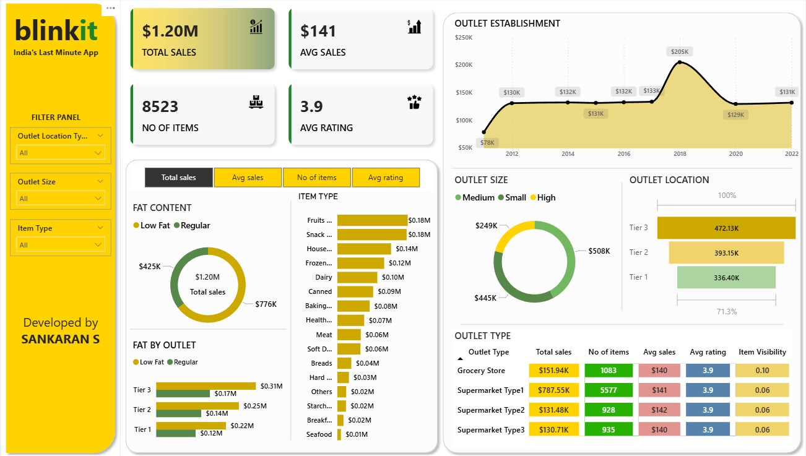

# 🛒 Blinkit Grocery Analytics Dashboard - Power BI

     

Interactive Power BI dashboard analyzing Blinkit (India's last-minute grocery delivery app) sales performance across different outlet types, locations, and product categories.



## 🎯 What This Project Shows

This dashboard analyzes Blinkit's grocery delivery business to understand:

- Sales performance across different outlet types
- Product category performance and ratings
- Fat content analysis of items
- Outlet establishment trends over time
- Geographic distribution of outlets


## 📊 Key Business Metrics

- **Total Sales**: \$1.20M
- **Average Sales**: \$141 per transaction
- **Number of Items**: 8,523 products
- **Average Rating**: 3.9/5.0
- **Outlet Types**: Grocery Store, 3 Supermarket Types
- **Time Period**: 2012-2022 establishment data


## 🏪 Dashboard Components

### 1. **Sales Performance Overview**

- Total Sales: \$1.20M across all outlets
- Average Sales: \$141 per transaction
- 8,523 different items in inventory
- 3.9 average customer rating


### 2. **Fat Content Analysis**

- **Regular Fat Items**: \$425K sales 
- **Low Fat Items**: \$776K sales 
- Regular fat products drive majority of revenue


### 3. **Item Type Performance**

- **Fruits and Vegetables**: \$0.18M (top category)
- **Snack Foods**: \$0.18M 
- **Household Items**: \$0.14M 
- **Frozen Foods**: \$0.12M
- **Dairy Products**: \$0.10M
- **Canned Goods**: \$0.09M


### 4. **Outlet Establishment Timeline**

- Peak establishment: 2018 (\$205K sales)
- Steady growth from 2012-2022
- Recent establishments showing strong performance


### 5. **Outlet Size Distribution**

- **Medium Outlets**: \$508K 
- **Small Outlets**: \$444K 
- **High Outlets**: \$249K 


### 6. **Outlet Location Analysis**

- **Tier 3**: \$472.13K (41.3% of sales)
- **Tier 2**: \$393.15K (34.4% of sales)
- **Tier 1**: \$336.40K (29.4% of sales)
- Tier 3 cities driving highest sales


### 7. **Outlet Type Performance**

- **Grocery Store**: \$151.94K sales, 1083 items, \$140 avg_sales, 3.9 avg_rating
- **Supermarket Type1**: \$787.55K sales, 5577 items, \$141 avg_sales, 3.9 avg_rating
- **Supermarket Type2**: \$131.48K sales, 928 items, \$142 avg_sales, 3.9 avg_rating
- **Supermarket Type3**: \$130.71K sales, 935 items, \$140 avg_sales, 3.9 avg_rating


### 8. **Interactive Filters**

- Outlet Location Type (All, Tier 1, 2, 3)
- Outlet Size (All, Small, Medium, High)
- Item Type (All categories available)


## 🔍 Key Business Insights

### Sales Distribution

- Supermarket Type1 dominates with 65% of total sales
- Tier 3 cities unexpectedly outperform Tier 1 cities
- Medium-sized outlets generate consistent revenue


### Product Performance

- low-fat products preferred over Regular fat alternatives
- Fresh categories (fruits/vegetables) lead sales
- Balanced portfolio across food categories


### Market Penetration

- Strong presence in smaller cities (Tier 3)
- Consistent average ratings across all outlet types
- Successful expansion from 2012 to 2022


### Customer Behavior

- Average transaction value of \$141 indicates healthy basket size
- 3.9 rating shows good customer satisfaction
- low fat preference suggests healthy priority over taste


## 🛠️ Power BI Skills Used

- **Data Import**: Connected grocery sales CSV data
- **KPI Cards**: Key metrics display
- **Donut Charts**: Fat content and outlet size analysis
- **Bar Charts**: Item type and location performance
- **Area Chart**: Outlet establishment timeline
- **Data Tables**: Detailed outlet type comparison
- **Interactive Slicers**: Multi-level filtering system
- **Custom Formatting**: Blinkit brand colors (yellow theme)
- **Calculated Fields**: Average sales, percentages
- **Data Modeling**: Product categorization and aggregation


## 📁 Project Files

```
📦 blinkit-analytics-powerbi/
├── 📄 README.md                    (This file)
├── 📊 Blinkit_analytics_dashboard.pbix  (Power BI file)
├── 📄 Blinkit_analytics_dashboard.pdf   (PDF export)
├── 📋 BlinkIT_Grocery_Data.xlsx    (Main dataset)
├── 📸 Dashboard_screenshot.jpg     (Dashboard view)
├── 📈 Avg_Sales.png               (Sales charts)
├── 🖼️ background_kpi.png          (Background images)
├── 📊 Items.png                   (icon)
├── ⭐ rating.png                  (icon)
└── 💰 Sales.png                   (icon)
```


## 📱 How to View

### Option 1: Interactive Dashboard

1. Download `Blinkit_analytics_dashboard.pbix`
2. Open with Power BI Desktop
3. Use filters to explore different segments

### Option 2: Static Report

1. Open `Blinkit_analytics_dashboard.pdf`
2. View complete analysis
3. See all metrics and insights

### Option 3: Quick Preview

- Check `Dashboard_screenshot.jpg` for overview


## 💡 Business Value

### For Blinkit Management

- Identify top-performing outlet types and locations
- Optimize product mix based on category performance
- Plan expansion strategy using establishment data


### For Operations Teams

- Focus resources on high-performing Tier 3 markets
- Balance regular vs low-fat product inventory
- Improve underperforming outlet categories


### For Marketing Teams

- Target campaigns based on location tier performance
- Promote high-rated categories
- Develop strategies for smaller outlet types


## 🎓 Skills Demonstrated

- ✅ Retail Analytics Dashboard Creation
- ✅ Multi-dimensional Data Analysis
- ✅ Geographic Performance Tracking
- ✅ Product Category Management
- ✅ Customer Rating Analysis
- ✅ Brand-themed Dashboard Design


## 🔮 Future Enhancements

- Seasonal sales pattern analysis
- Customer demographic insights
- Delivery time optimization
- Inventory turnover analysis
- Competitor benchmarking

***

**Created by**: [sankaran-s2001](https://github.com/sankaran-s2001)
**Tools Used**: Power BI, Excel data processing
**Project Type**: Retail Analytics Dashboard
**Domain**: Grocery Delivery Business Intelligence

## ✉️ Contact

**Sankaran S**  
[](https://github.com/sankaran-s2001) [](https://www.linkedin.com/in/sankaran-s21/) [](mailto:sankaran121101@gmail.com)

*Complete analysis of Blinkit's grocery delivery performance with 8,500+ products across multiple outlet types and locations*
